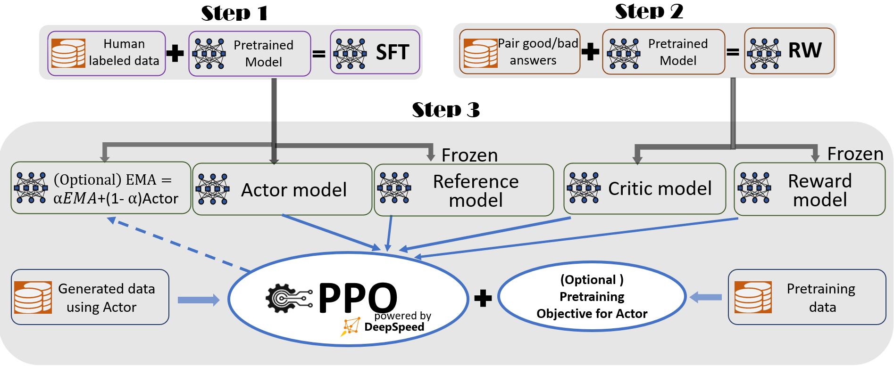

## ☕ 快速开始 ☕

### 🐼 安装

```bash
pip install deepspeed>=0.9.0

git clone https://github.com/microsoft/DeepSpeedExamples.git
cd DeepSpeedExamples/applications/DeepSpeed-Chat/
pip install -r requirements.txt
```

### 🐼 一个脚本完成 RLHF 训练的所有三个步骤并生成您的第一个 ChatGPT 模型


&nbsp;&nbsp;**:yellow_heart: Coffee Time Training for a 1.3B ChatGPT Model**


<details><summary> Expand </summary><p>

  ```bash
  python train.py --actor-model facebook/opt-1.3b --reward-model facebook/opt-350m --deployment-type single_gpu
  ```

  | Model Size (A6000-48G)            | Step 1  | Step 2  | Step 3 | Total  |
  | --------------------------------- | ------- | ------- | ------ | ------ |
  | Actor: OPT-1.3B  Reward: OPT-350M | 2900 Sec | 670 Sec | 1.2hr | 2.2hr |

 </p></details>

&nbsp;&nbsp;**:green_heart: Half Day Training on a Single Commodity GPU Node for a 13B ChatGPT Model**

<details><summary> Expand </summary><p>

  ```bash
  python train.py --actor-model facebook/opt-13b --reward-model facebook/opt-350m --deployment-type single_node
  ```

  | Model Size (A100-40G)          | Step 1 | Step 2 | Step 3 | Total  |
  | ------------------------------- | ------ | ------ | ------ | ------ |
  | Actor: OPT-13B Reward: OPT-350M | 2.5hr  | 0.25hr | 10.8hr | 13.6hr |

</p></details>

### 🐼 演示：单个步骤微调

#### 🕐 Step 1 - [Supervised Fine-Tuning](./training/step1_supervised_finetuning)

<details><summary> Expand </summary><p>

```bash
# Move into the first step of the pipeline
cd training/step1_supervised_finetuning/

# Run the training script
bash training_scripts/opt/single_gpu/run_1.3b.sh

# Evaluate the model
bash evaluation_scripts/run_prompt.sh
```

</p></details>

#### 🕑 Step 2 - [Reward Model](./training/step2_reward_model_finetuning)

<details><summary> Expand </summary><p>

```bash
# Move into the second step of the pipeline
cd training/step2_reward_model_finetuning

# Run the training script
bash training_scripts/opt/single_gpu/run_350m.sh

# Evaluate the model
bash evaluation_scripts/run_eval.sh
```

</p></details>

#### 🕒 Step 3 - [Reinforcement Learning with Human Feedback](./training/step3_rlhf_finetuning)

<p align="center">



Figure 1: The illustration of DeepSpeed Chat’s RLHF training pipeline with optional features.


</p>

<details><summary> Expand </summary><p>

```bash
# Move into the final step of the pipeline
cd training/step3_rlhf_finetuning/

# Run the training script
bash training_scripts/opt/single_gpu/run_1.3b.sh
```
</p></details>


### 🐼 Adding and using your own datasets in DeepSpeed-Chat
In addition to the datasets used in our example scripts, you can also add and use your own datasets. To do so, first you need to add a new Class in [training/utils/data/raw_datasets.py](https://github.com/microsoft/DeepSpeedExamples/blob/master/applications/DeepSpeed-Chat/training/utils/data/raw_datasets.py) to define the format when using your data. You need to make sure to follow the APIs and format defined in the PromptRawDataset class to ensure a consistent data format that DeepSpeed-Chat relies on. You can look at the existing classes to learn how to do so.

Second, you need to add an if condition in function get_raw_dataset in [training/utils/data/data_utils.py](https://github.com/microsoft/DeepSpeedExamples/blob/master/applications/DeepSpeed-Chat/training/utils/data/data_utils.py) corresponding to your new dataset. The dataset_name string in the if condition should be the dataset name you will provide as a arg for the training scripts. Last, you need to add your new dataset's dataset_name into your "--data_path" arg in your training scripts.  
If you have downloaded huggingface datasets manually, you can add your local path into "--data_path", such as "--data_path ./relative/Dahoas/rm-static" and "--data_path /absolute/Dahoas/rm-static". Remeber you should not make `data/` in your local path, it may cause an exception to `load_dataset`.

One thing to note that some datasets may only have one response instead of two responses. For those datasets, you can only use them in step 1. And in such case, you should add the dataset_name as part of the "--sft_only_data_path" arg instead of the "--data_path" arg. One thing to note is that: If you plan to only do step 1 SFT, adding more single-response datasets is definitely beneficial. However, if you do plan to do steps 2 and 3, then adding too many single-response datasets during SFT could backfire: these data could be different from the data used for steps 2/3, generating different distributions which could cause training instability/worse model quality during step 2/3. That is part of the reason why we focused on trying the datasets with two responses and the preference, and always split a dataset into all 3 steps.

If you have your own dataset in local files, you can also use it by following these rules:
* Pass "local/jsonfile" as the dataset name to the "--data_path" argument.
* Put your train data and evaluation data in applications/DeepSpeed-Chat/data/ with name train.json and eval.json.
* The json data in file should be a single list with each item like ***{"prompt": "Human: I have a question. Assistant:", "chosen": "Good answer.", "rejected": "Bad answer."}***.

What is more, when you use your own dataset files and modified some data in them, pay attention to the parameter "reload" of ***create_prompt_dataset*** function. You should pass a True value to it or the cache files will not refresh.

### 🐼 Customizing your own RLHF training pipeline using DeepSpeed-Chat’s RLHF APIs

DeepSpeed-Chat allows users to build their very own RLHF training pipeline using our flexible APIs shown below, which users can use to reconstruct their own RLHF training strategy. This enables a general interface and backend for creating a wide range of RLHF algorithms for research exploration.

```python
engine = DeepSpeedRLHFEngine(
  actor_model_name_or_path=args.actor_model_name_or_path,
  critic_model_name_or_path=args.critic_model_name_or_path,
  tokenizer=tokenizer,
  num_total_iters=num_total_iters,
  args=args)

trainer = DeepSpeedPPOTrainer(engine=engine, args=args)

for prompt_batch in prompt_train_dataloader:
  out = trainer.generate_experience(prompt_batch)
  actor_loss, critic_loss = trainer.train_rlhf(out)

```

### 🐼 Serving: Plug-in your final model trained by DeepSpeed-Chat and test it out!
For quickly testing your final models trained by DeepSpeed-Chat, we provide a simple script below. For users who want to use our trained models to create different LLM applications such as personal assistant, chatbot and code understanding, please refer to [LangChain](https://github.com/hwchase17/langchain).

```bash
# serve the final model
python chat.py --path  ${PATH-to-your-actor-model}
```
***Example 1: Q&A Session from serving a 1.3B final model trained from DeepSpeed-Chat***


<div align="center">


</div>


***Example 2: Multi-Round Conversations from serving a model trained from DeepSpeed-Chat***


<div align="center">


</div>

### 🐲 Throughput and Model Size Scalability Comparisons with Existing RLHF Systems

&nbsp;&nbsp;***(I) Single-GPU's Model Scale and Throughput Comparison***

&nbsp;&nbsp;With over an order of magnitude higher throughput, DeepSpeed-Chat unlocks the ability to train significantly larger actor models under the same latency budget or train models of similar size at much lower cost, compared to the existing systems like Colossal-AI or HuggingFace-DDP. For example, on a single GPU, DeepSpeed enables over **10X** throughput improvement for RLHF training on a single GPU. While both CAI-Coati and HF-DDP can run a max model size of 1.3B, DeepSpeed can run 6.5B model on the same hardware, **5x** higher.  

<p align="center">


Figure 2: Step 3 throughput comparison against two other system frameworks (Colossal AI's Coati and Huggingface-DDP) for accelerating RLHF training on a single NVIDIA A100-40G commodity GPU. No icons represent OOM scenarios.  

</p>

&nbsp;&nbsp;***(II) Single-Node Multi-GPU Model Scale and Throughput Comparison***

On multi-GPUs of a single node, DeepSpeed-Chat enables **6-19X** speedup over CAI-Coati and **1.4-10.5X** speedup over HF-DDP (Figure 3) with respect to system throughput.  

<p align="center">


Figure 3. End-to-end training throughput comparison for step 3 of the training pipeline (the most time consuming portion) with different model sizes on a single DGX node equipped with 8 NVIDIA A100-40G GPUs. No icons represent OOM scenarios.  

</p>

&nbsp;&nbsp;***(III) Superior Generation Phase Acceleration in Step3***

One of the key reasons that result in Figure 3 is our Hybrid Engine's superior generation phase acceleration, shown below.

<p align="center">


Figure 4. Superior generation phase acceleration from DeepSpeed Chat’s Hybrid Engine: A time/sequence breakdown for training OPT-1.3B actor model + OPT-350M reward model on a single DGX node with 8 A100-40G GPUs.

</p>

For other detailed results and in-depth analysis, including effective throughput and scalability of DeepSpeed-Chat, please refer to our [Blog Post](https://github.com/microsoft/DeepSpeed/tree/master/blogs/deepspeed-chat).

## 😽 Supported Models 😽


Currently, we support the following model families. We will continue to grow over time to including emerging models for ChatGPT-style training! See [Roadmap](#-deepspeed-chats-roadmap-) for more details.

model family | size range
------ | ------
[opt](https://huggingface.co/models?other=opt) | 0.1B - 66B
[bloom](https://huggingface.co/models?other=bloom) | 0.3B - 176B
[gpt\_neox](https://huggingface.co/models?other=gpt_neox) | 1.3B - 20B
[gptj](https://huggingface.co/models?other=gptj) | 1.4B - 6B
[gpt\_neo](https://huggingface.co/models?other=gpt_neo) | 0.1B - 2.7B
[gpt2](https://huggingface.co/models?other=gpt2) | 0.3B - 1.5B
[codegen](https://huggingface.co/Salesforce/codegen-16B-multi) | 0.35b - 16B

* All performance and accuracy tests have been performed using the OPT model family only. For other models, please see our training_scripts folder on how to change model families.


## 🔬 Build Pipeline Status 🔬

| Description | Status |
| ----------- | ------ |
| Integrations | [](https://github.com/microsoft/DeepSpeed/actions/workflows/nv-ds-chat.yml) |

A DeepSpeed CI workflow runs the DeepSpeed-Chat Step 3 pipeline nightly across the following test configurations:

Models
```
Actor:  facebook/opt-125m
Critic: facebook/opt-125m (trained in DS-Chat Step 2)
```

Parameters comprising test matrix
```
Zero Stage:    2, 3
Hybrid Engine: True, False
Offload:       True, False
LoRA:          True, False
```

Each configuration (16 total) runs through a limited number of Step 3 non-overflow training steps (i.e. steps where neither actor nor critic overflow) and saves the actor/critic models.
Assertions are used to check if the training pipeline executed correctly and if the actor and critic models were saved properly.


## ⚓ Documentation and Tutorial ⚓

For more APIs, example scripts, and evaluation results, please refer to
  - [**Step1: Supervised Fine-Tuning (SFT)**](./training/step1_supervised_finetuning/README.md)
  - [**Step2: Reward Model Fine-Tuning**](./training/step2_reward_model_finetuning/README.md)
  - [**Step3: Reinforcement Learning Human Feedback (RLHF)**](./training/step3_rlhf_finetuning/README.md)
  - [**Training Details Explanation**](./training/README.md)

## 🌱 DeepSpeed Chat's Roadmap 🌱


Our future plan includes but not limited to :
- [ ] System support and finetuning for LLaMA
- [ ] ZeRO-Offload (CPU/NVMe) is currently not supported but coming soon
- [ ] Generalizing DeepSpeed-RLHF abstraction and system support for a wide range of RL algorithms/paradigms
- [ ] Auto-tuning of system optimizations

## 💬 DeepSpeed Chat and DeepSpeed Community 💬

Just like how the success of [the BLOOM model](https://huggingface.co/bigscience/bloom) was supported by both [DeepSpeed Team](https://github.com/bigscience-workshop/Megatron-DeepSpeed) and many [open source contributors](https://huggingface.co/bigscience), we welcome all AI developers/practitioners/researchers to join this on-going effort for DeepSpeed-Chat. To participate:
- Show your support by leaving a star ⭐ to our [DeepSpeed](https://github.com/microsoft/DeepSpeed) and [DeepSpeedExamples](https://github.com/microsoft/DeepSpeedExamples) GitHub repositories.
- Follow us on [twitter](https://twitter.com/MSFTDeepSpeed) to get notified about our latest news. For Chinese users, you can also follow our [Chinese Zhihu account](https://www.zhihu.com/people/deepspeed). For Japanese users, you can also follow our [Japanese twitter account](https://twitter.com/MSFTDeepSpeedJP).
- Currently we prefer to interact with open source users mainly on GitHub so that it's easier for all users to search for related information. For bug report, please submit a GitHub issue. For contribution, please submit a pull request (PR). For general question/discussion, please open a new discussion or join any existing discussions.
- We are open to collaborations with universities, research labs, companies, such as working together on deep learning research, applying DeepSpeed to empower real-world AI models and applications, and so on. For such requests (and other requests unsuitable for GitHub), please directly email to deepspeed-info@microsoft.com.


## 🙏 Acknowledgement and Citation 🙏

We thank the following papers and open-source repositories:

    [1] Schulman, John, et al. "Introducing ChatGPT", https://openai.com/blog/chatgpt (2022).
    [2] Ouyang, Long, et al. "Training language models to follow instructions with human feedback." arXiv preprint arXiv:2203.02155 (2022). This is also referred as InstructGPT
    [3] Stiennon, Nisan, et al. "Learning to summarise with human feedback." Advances in Neural Information Processing Systems 33 (2020): 3008-3021.
    [4] Transformers Hugging Face (github.com)
    [5] CarperAI, https://github.com/CarperAI/trlx
    [6] lvwerra/trl: Train transformer language models with reinforcement learning. (github.com)
    [7] pg-is-all-you-need/02.PPO.ipynb at master · MrSyee/pg-is-all-you-need (github.com)
